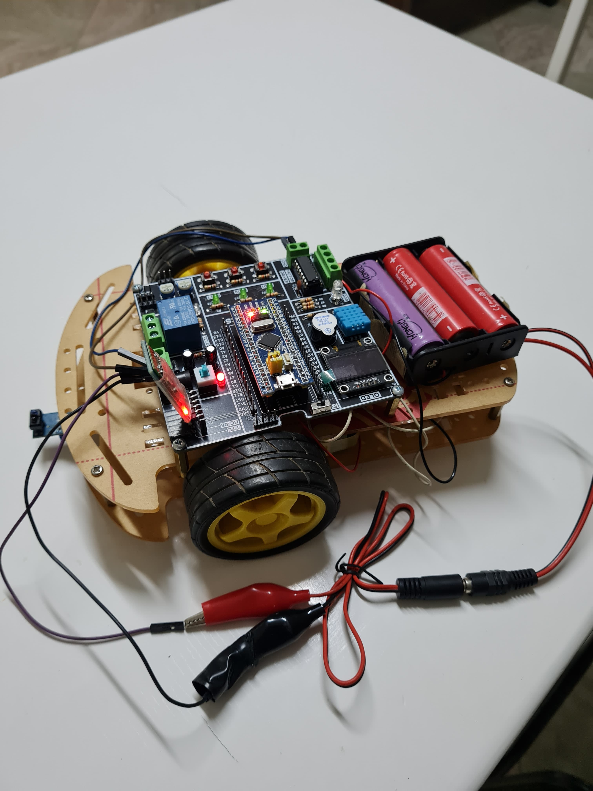

# RC Car with STM32 ARM Microcontroller

## Overview

Welcome to the RC Car project repository! This project showcases the development of a remote-controlled car using an STM32 ARM microcontroller and modern C++ programming techniques. This repository serves as a hub for all the hardware design, software code, and documentation related to building your own RC car.

## Features

- **STM32 ARM Microcontroller**: We utilize the powerful STM32 microcontroller to control and manage various aspects of the RC car, ensuring smooth and efficient operation.

- **Modern C++ Programming**: The software for this project is written in modern C++ to make the codebase clean, maintainable, and efficient.

- **Remote Control**: You can control the RC car remotely using a dedicated controller or via a smartphone application, providing a seamless and intuitive user experience.

- **Real-time Feedback**: The car is equipped with sensors to provide real-time feedback on its speed, direction, and environmental conditions.

- **Customizable**: The project is highly customizable, allowing you to add features, sensors, and accessories to suit your preferences.

## Repository Contents

- **Hardware Design**: Find detailed schematics, PCB layouts, and component lists for building the physical RC car.

- **Firmware**: The C++ codebase for the STM32 microcontroller is organized in this section. It includes drivers, control algorithms, and communication protocols.

- **Documentation**: Comprehensive documentation on how to set up the hardware, flash the firmware, and control the RC car.

- **Tutorials**: Step-by-step guides and tutorials to help you get started with building and programming your RC car.

## Getting Started

1. Clone this repository to your local machine.
2. Refer to the documentation to gather the required components and follow the assembly instructions.
3. Flash the firmware onto the STM32 microcontroller using the provided instructions.
4. Power up your RC car and start exploring its features.

## Contributions

Contributions to this project are welcome! Whether you want to enhance the software, improve the hardware design, or suggest new features, we encourage you to get involved. Please review our contribution guidelines for more information.

<<<<<<< HEAD
## License

This project is licensed under the [MIT License](LICENSE.md), which means you are free to use, modify, and distribute the code for your own purposes.

## Contact

If you have any questions, issues, or suggestions, feel free to reach out to us through the [GitHub Issues](https://github.com/abdallahhessam/rc-car/issues) or [Discussions](https://github.com/abdallahhessam/rc-car/discussions) section of this repository.
=======

## Contact

If you have any questions, issues, or suggestions, feel free to reach out to us through the [GitHub Issues](https://github.com/abdallahhessam/rc-car/issues) section of this repository.
>>>>>>> 6b07dd5acb39c3e809ce7cee44e40f5818a90db6

We hope you enjoy building and experimenting with your very own RC car powered by STM32 ARM and modern C++!
